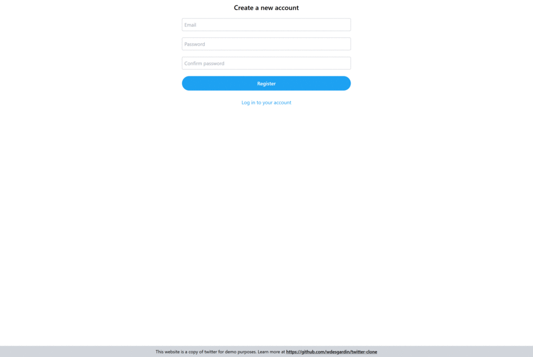

# Twitter-clone

[](https://github.com/wdesgardin/twitter-clone/actions/workflows/ci.yml)

This project was originally forked from [https://github.com/wdesgardin/twitter-clone](https://github.com/wdesgardin/twitter-clone)

Twitter clone based on Jason Taylor's [clean architecture template](https://github.com/jasontaylordev/CleanArchitecture).  
  
A demo is available at [https://twittercloneapp.azurewebsites.net/](https://twittercloneapp.azurewebsites.net/) (hosted on an Azure Web App Service instance)  



## Technologies

- [ASP.NET Core 9](https://docs.microsoft.com/en-us/aspnet/core/?view=aspnetcore-9.0)
- [Entity Framework Core 9](https://docs.microsoft.com/en-us/ef/core/)
- [SignalR](https://docs.microsoft.com/en-us/aspnet/signalr/overview/getting-started/introduction-to-signalr)
- [React](https://reactjs.org/)
- [TailwindCSS](https://tailwindcss.com/)
- [MediatR](https://github.com/jbogard/MediatR)
- [AutoMapper](https://automapper.org/)
- [FluentValidation](https://fluentvalidation.net/)
- [NUnit](https://nunit.org/), [FluentAssertions](https://fluentassertions.com/), [Moq](https://github.com/moq) & [Respawn](https://github.com/jbogard/Respawn)
- [Docker](https://www.docker.com/)

## Getting Started

1. Install the latest [.NET 9 SDK](https://dotnet.microsoft.com/download/dotnet/9.0)
2. Install the latest [Node.js LTS](https://nodejs.org/en/)
3. Navigate to `src/WebUI` and run `dotnet run` to launch the back end (ASP.NET Core Web API), and the front end (React SPA)

## Database Configuration

The template is configured to use an in-memory database by default. This ensures that all users will be able to run the solution without needing to set up additional infrastructure.

If you would like to use PostegreSQL, you will need to update **WebUI/appsettings.json** as follows:

```json
  "UseInMemoryDatabase": false,
```

Verify that the **DefaultConnection** connection string within **appsettings.json** points to a valid PostegreSQL instance.

When you run the application the database will be automatically created (if necessary) and the latest migrations will be applied.

### Database Migrations

To use `dotnet-ef` for your migrations please add the following flags to your command (values assume you are executing from repository root)

- `--project src/Infrastructure` (optional if in this folder)
- `--startup-project src/WebUI`
- `--output-dir Persistence/Migrations`

For example, to add a new migration from the root folder:

`dotnet ef migrations add "SampleMigration" --project src\Infrastructure --startup-project src\WebUI --output-dir Persistence\Migrations`

## Overview

### Domain

This will contain all entities, enums, exceptions, interfaces, types and logic specific to the domain layer.

### Application

This layer contains all application logic. It is dependent on the domain layer, but has no dependencies on any other layer or project. This layer defines interfaces that are implemented by outside layers. For example, if the application need to access a notification service, a new interface would be added to application and an implementation would be created within infrastructure.

### Infrastructure

This layer contains classes for accessing external resources such as file systems, web services, smtp, and so on. These classes should be based on interfaces defined within the application layer.

### WebUI

This layer is a single page application based on React and ASP.NET Core 7. This layer depends on both the Application and Infrastructure layers, however, the dependency on Infrastructure is only to support dependency injection. Therefore only _Startup.cs_ should reference Infrastructure.

## License

This project is licensed with the [MIT license](LICENSE).
